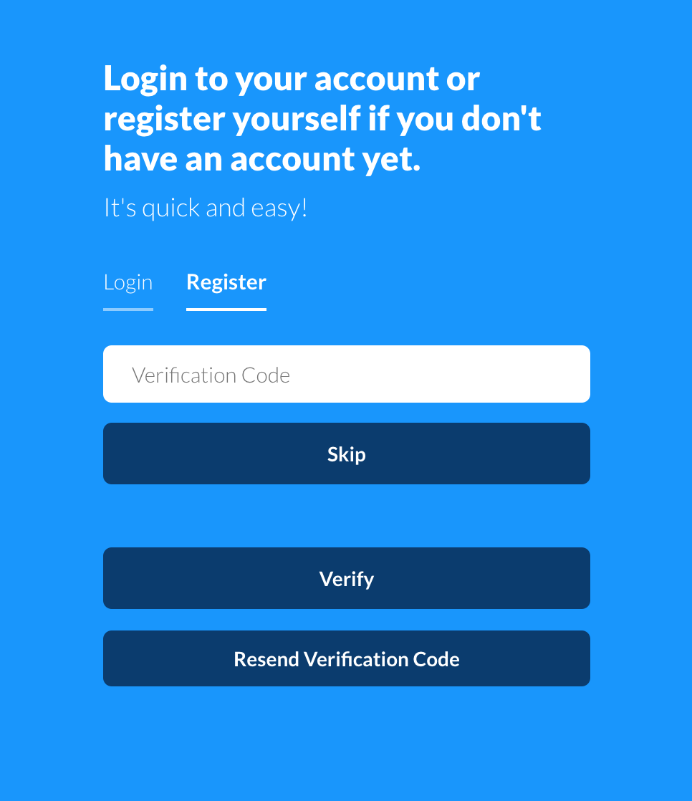
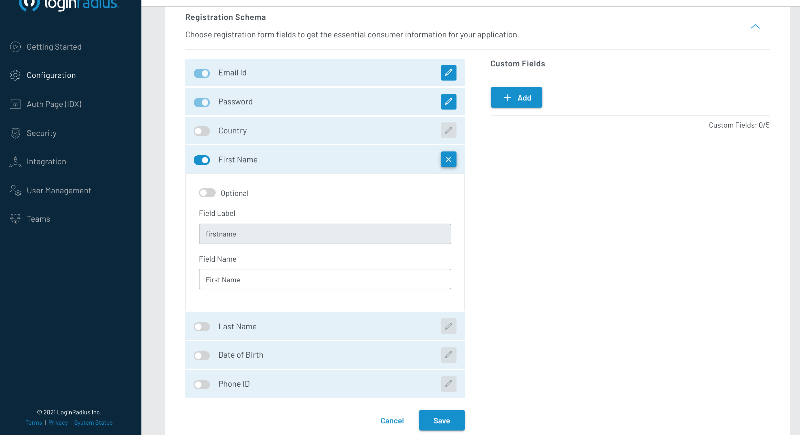
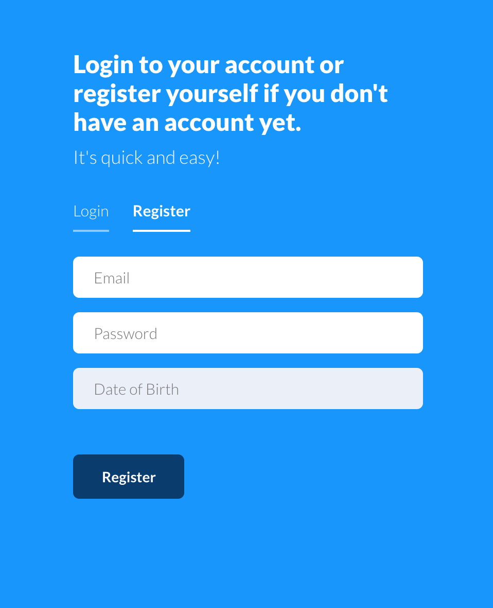
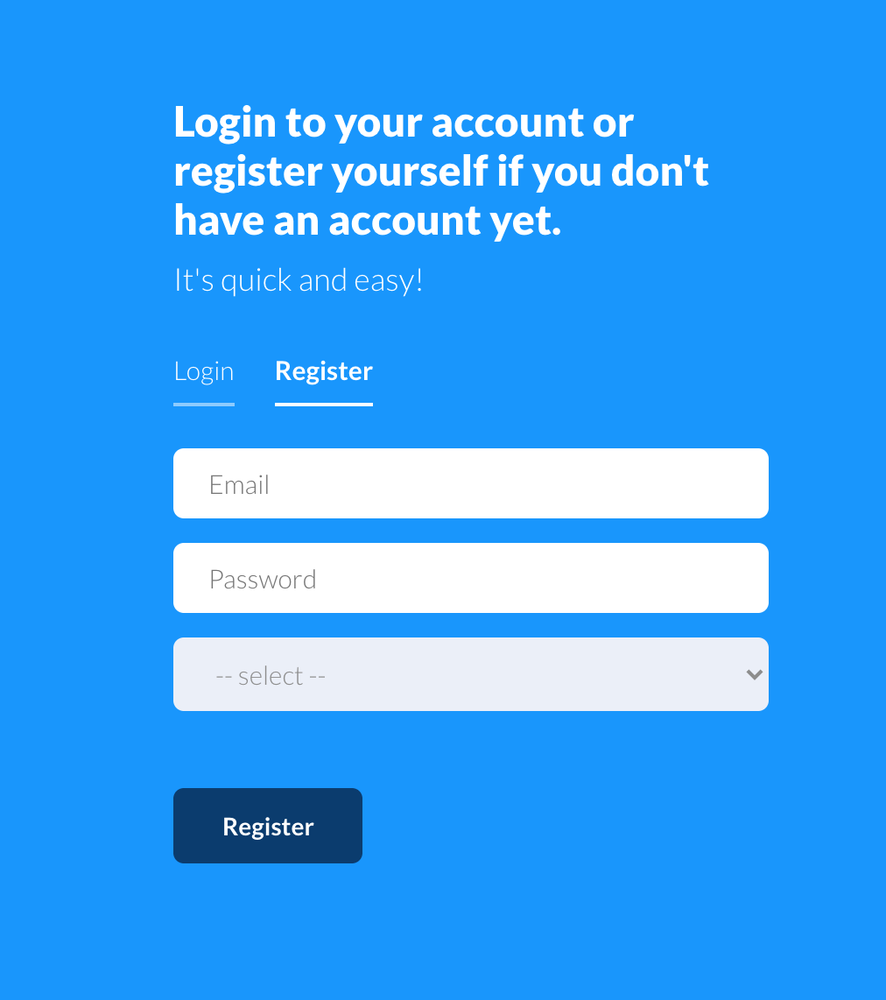
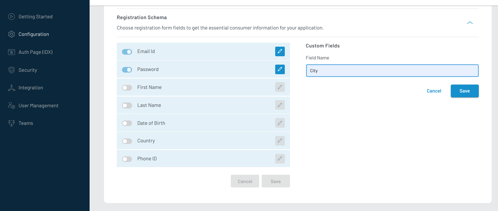

Developer
Developer Pro

# Customize Registration Form Fields

**Navigation**

In <a href="https://dashboard.loginradius.com" target="_blank">Loginradius Dashboard</a> go to *Configuration* -> *Auth Configuration* -> *Registration Schema*

The following Field Labels are the options available for the consumer to login to your application.

> **Note:** Field Names,not Field labels appear in Registration form fields list in Configuration section of Loginradius Dashboard.These names will be shown to consumers when they are registering to your application.

## emailid

This label is used when you want the consumer to register to your application using Email ID.

This field is mandatory for the consumer.

### Step1

Set the field name that the consumer sees while registering e.g Email Id

### Step2

Auth page screen will be as shown below:

## password

This label is used when you want the consumer to register to your application with a password.

This field is mandatory for the consumer.

### Step1

Set the field name that the consumer sees while registering eg. Password

### Step2

Auth page screen will be as shown below:

## phoneid

This label is used when you want the consumer to register to your application using Phone ID.

Check this option to enable in Phone ID registration process.

### Step1

Set the field name that the consumer sees while registering e.g Phone ID

### Step2

Check the optional tag if you want the consumer to choose to register to your application with Phone ID otherwise select the mandatory tag.

### Step3

Auth page screen will be as shown below:

### Step4

A verification code will be sent to your device with the corresponding Phone ID.You can choose to

* Verify

* Skip

* Resend

## firstname

This label is used when you want the consumer to register to your application using First Name.

Check this option to enable in First Name in registration process.

### Step1

Set the field name that the consumer sees while registering e.g First Name

### Step2

Check the optional tag if you want the consumer to choose to register to your application with Phone ID otherwise select the mandatory tag.

### Step3

Auth page screen will be as shown below:

## lastname

This label is used when you want the consumer to register to your application using First Name.

Check this option to enable Last name in registration process.

### Step1

Set the field name that the consumer sees while registering e.g Last Name

### Step2

Check the optional tag if you want the consumer to choose to register to your application with Phone ID otherwise select the mandatory tag.

### Step3

Auth page screen will be as shown below:

## birthdate

This label is used when you want the consumer to register to your application using First Name.

Check this option to enable in Date of Birth registration process.

### Step1

Set the field name that the consumer sees while registering e.g Date of Birth

### Step2

Check the optional tag if you want the consumer to choose to register to your application with Phone ID otherwise select the mandatory tag.

### Step3

Auth page screen will be as shown below:

## country

This label is used when you want the consumer to register to your application using First Name.

Check this option to enable Country name in registration process.

### Step1

Set the field name that the consumer sees while registering i.e Country

### Step2

Check the optional tag if you want the consumer to choose to register to your application with Phone ID otherwise select the mandatory tag.

### Step3

Select whether to configure the Field Type as String or Option
ß
### Step4a

If the field Type is String.

Auth page screen will be as shown below:

### Step4b

If the field Type is Option.

Add the key-value pairs in the Option section so that the consumer can select one while registering.

e.g here USA and India are added

Auth page screen will be as shown below:

## Custom Fields

### Step 1

You can create custom fields using the **Add** option in **Custom Fields** in the **Registration Schema** section. 

### Step 2

Add(or Delete) the newly created Custom Field to Registation Form Fields e.g City

### Step 3

Check the optional tag if you want the consumer to choose to register to your application with Custom Field otherwise select the mandatory tag

### Step 4

Select the Field Type from the list below

* String

* Password

* Checkbox 

* Option

* Email

* Text

### Step 5

Add your own set of validation rules in the **validation string** section.

<a href="https://www.loginradius.com/docs/developer/references/javascript-library/customizing-your-registration-schema" target="_blank">Configure Custom registration using JS</a>

The Custom Fields added will be displayed during registration.

**Login Methods**

<a href="https://www.loginradius.com/docs/developer/guide/emailpassword-login" target="_blank">Email/Password Login</a>

<a href="https://www.loginradius.com/docs/developer/guide/social-login" target="_blank">Social Login</a>

<a href="https://www.loginradius.com/docs/developer/guide/phone-login" target="_blank">Phone Login</a>

<a href="https://www.loginradius.com/docs/developer/guide/passwordless-login" target="_blank">Passwordless Login</a>