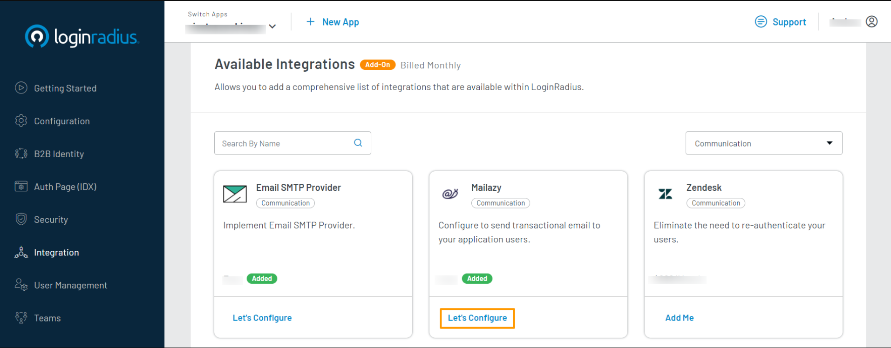
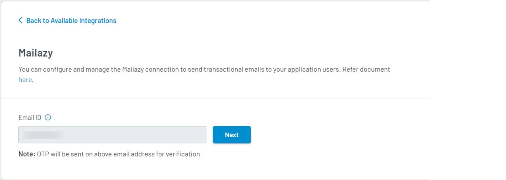
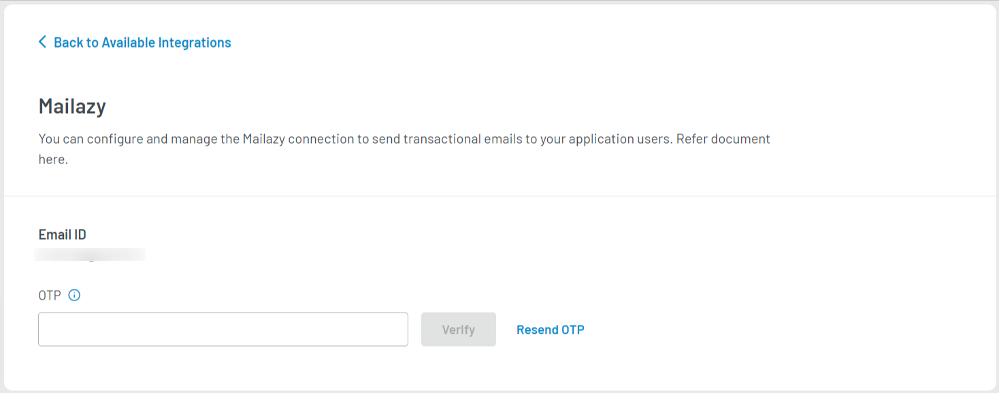
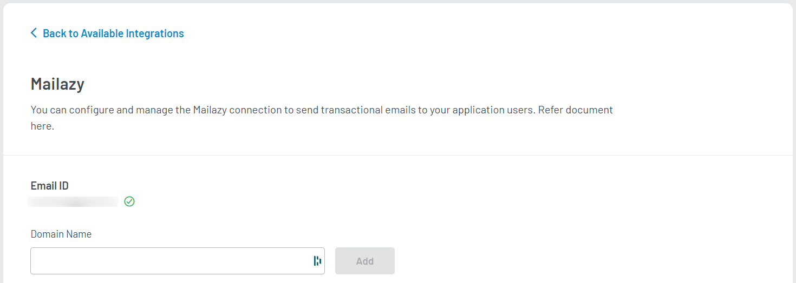
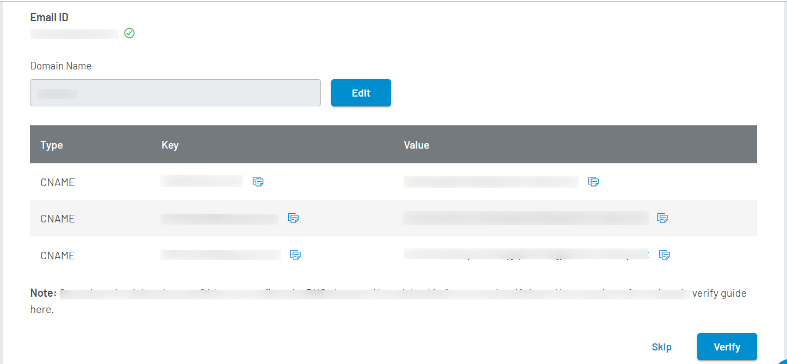
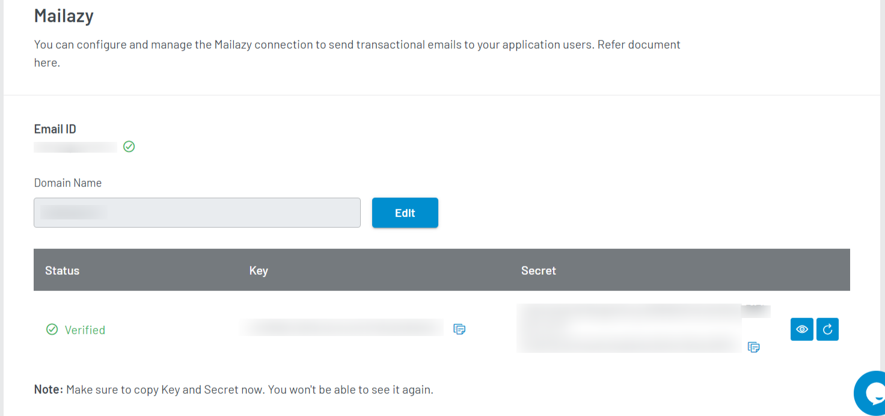

# Mailazy  
This document provides instructions to configure Mailazy integration for sending out transactional emails.

## LoginRadius Dashboard Configuration
This section covers the required configurations that you need to perform in the LoginRadius Dashboard for configuring Mailazy integration.

1. Log in to your <a href="https://dashboard.loginradius.com/" target="_blank">LoginRadius Dashboard</a> account, select your app and navigate to <a href="https://dashboard.loginradius.com/integration" target="_blank">Integration</a>.
 
   The following screen will appear:

   

2. Click the **Add** button, either search for **Mailazy** in the search bar or go to the **Select Category** dropdown and select **Communication**. Locate **Mailazy** and click the **Let’s Configure**.

   

   The following screen will appear:

   

3. Click the **Next** button given next to your email id. 
   
   >**Note:** Your account email id is prefilled here and you cannot change it. Also, it automatically creates a Mailazy account, if it does not exist for the given email address.
   >
   > An OTP will be sent to your email id. 

   The following screen will appear: 
   

4. Enter OTP received on your email id and click the **Verify** button. 

   >**Note**: Click the **Resend OTP** link to receive another OTP.
   
   The following screen will appear upon email id verification:

   

  
5. Enter your **Domain Name** and click the **Add** button. The following screen will appear with CNAME key and value.

   

6. Copy the CNAME records and update them on your Domain.

   >**Note:** Sometimes it might take up to 24 hours to reflect the DNS changes. If verification fails, you should wait and verify later.

7. Click the **Verify** button to verify your domain.

8. Upon successful verification, it generates **Key** and **Secret** that you can use to configure Mailazy as <a href="https://www.loginradius.com/docs/developer/guide/setup-your-smtp-provider" target="blank"> SMTP provider in LoginRadius </a>. The configuration has been explained [below](#smtp-mailazy-configurations).

   >**Note:** You can use generated **Key** and **Secret** to integrate Mailazy for sending emails in any application.

    

   >**Note:** Make sure to copy **Key** and **Secret**. To get these values later, you will have to regenerate/reset. 
   > 
   >If you reset API Key and Secret, any API calls you have developed will stop working until you update them with  new values.

## SMTP Mailazy Configurations

1. Access SMTP Configurations as explained <a href="https://www.loginradius.com/docs/developer/guide/setup-your-smtp-provider" target="blank">here</a>

2. Select **Mailazy** from the **SMTP Provider** drop-down list.

   

3. Enter the **Key** and **Secret** obtained from the above [section](#loginradius-dashboard-configuration).

4. Enter the desired **From Name** and **Email Id** in the respective text boxes.

   >**Note**: Email Id should belong to domain added and verified in the above [section](#loginradius-dashboard-configuration).

5. Click the **Save** button to save the configurations.

>**Note:** Now, you can try performing the action to receive the email. For example, open your [Auth Page(IDX)](https://www.loginradius.com/docs/developer/concepts/idx) and follow the forget password process to receive an email via Mailazy.

   